<h1 align="center">基于Spring Boot + Vue3 的宿舍管理系统【带论文】</h1>

- <b>完整代码获取地址：从戎源码网 ([https://armycodes.com/](https://armycodes.com/))</b>
- <b>技术探讨、资料分享，请加QQ群：692619798</b>
- <b>作者微信：19941326836  QQ：3645296857</b>
- <b>承接计算机毕业设计、Java毕业设计、Python毕业设计、深度学习、机器学习</b>
- <b>选题+开题报告+任务书+程序定制+安装调试+论文+答辩ppt 一条龙服务</b>
- <b>所有选题地址 ([https://github.com/Descartes007/allProject](https://github.com/Descartes007/allProject)) </b>

## 一、项目介绍

### 基于 Spring Boot + Vue3 的宿舍管理系统，系统角色为 管理员（Admin）、宿管（DormManager） 和 学生（Student）。系统聚焦宿舍/床位管理、报修与调宿流程、公告与访客管理，主要功能如下：
### 管理员（Admin）
- 基本操作：登录、获取/修改个人信息、退出登录
### 用户/角色类管理：管理宿管账号（增删改查）、查看/修改管理员信息
### 楼宇/宿舍管理：楼宇与房间的增删改查、删除床位学生、检查房间/床位状态
### 学生管理：学生信息增删改查、按学号/用户名查询学生
### 公告管理：发布/编辑/删除/分页查询公告、首页公告获取
- 报修管理：发布/处理/删除/分页查询报修，报修统计
- 调宿申请：查看/审批调宿申请（审批通过会更新房间表）
### 访客管理：访客记录的增删改查
### 首页统计：学生总数、空宿舍数、已住宿人数、各楼人数、报修数量（用于图表展示）
### 宿管（DormManager）
- 基本操作：登录、获取/修改个人信息
- 公告管理：获取/发布/删除公告
### 学生与宿舍日常管理：查看/筛选学生、查看宿舍信息、参与报修处理与调宿审批
### 访客/报修/调宿：提交与处理对应记录（受权限约束）
### 学生（Student）
- 基本操作：登录、查看/修改个人信息
- 我的宿舍：查询本人宿舍信息
- 报修与调宿：发起报修、申请调宿

## 二、项目技术

- 编程语言：Java（后端）；J Vue 3（前端）
- 后端框架与库：Spring Boot 2.x, MyBatis-Plus, Lombok, Hutool, Fastjson,
- 前端技术：Vue 3, Vue Router, Vuex, Element Plus, Axios, ECharts, WangEditor

## 三、运行环境

- JDK版本：1.8及以上都可以
- 操作系统：Windows7/10、MacOS
- 开发工具：IDEA、Ecplise、MyEclipse都可以

## 四、数据库配置文件

- npm版本：6.14.13及以上都可以
- Redis版本：3.2.100及以上都可以
- 文件名：application.yml
- 编码类型：utf8

## 论文截图

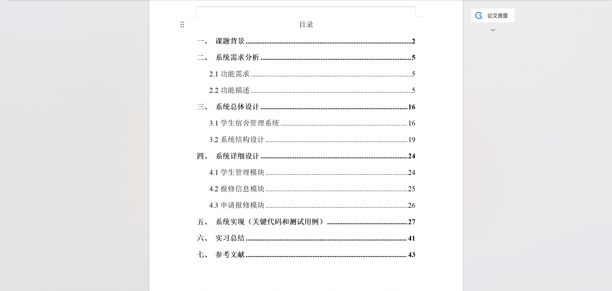

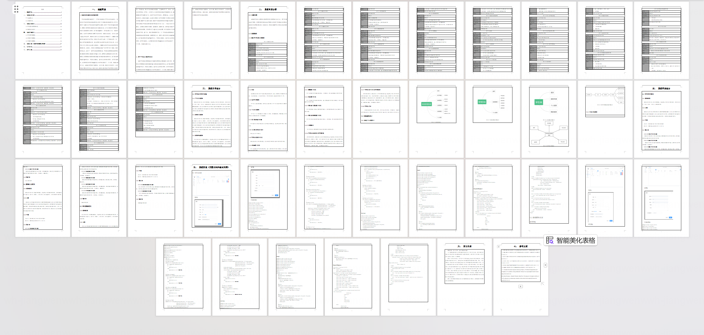

## 系统截图

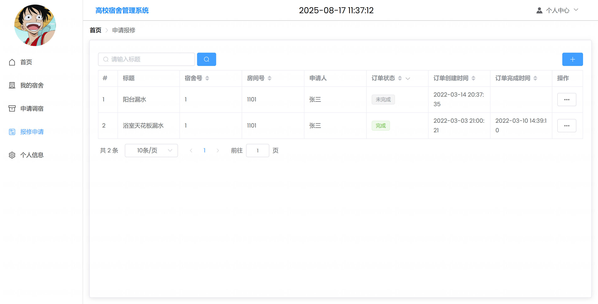

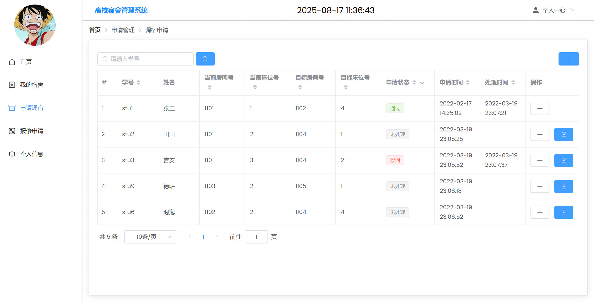

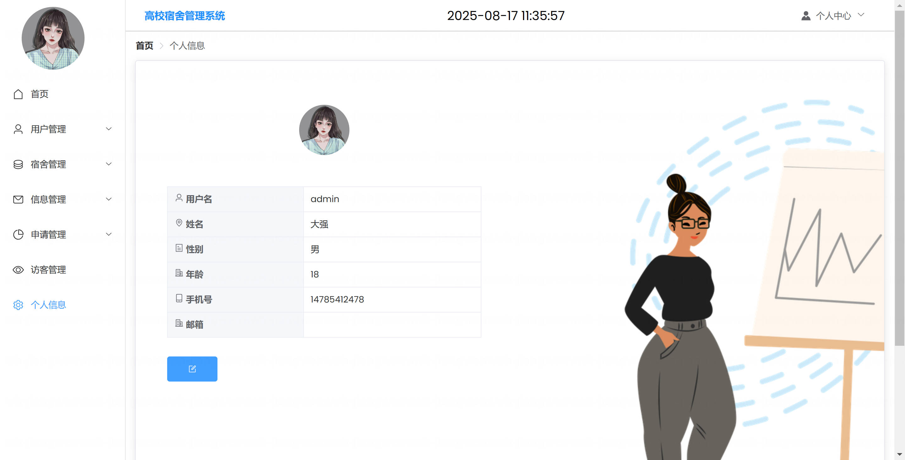

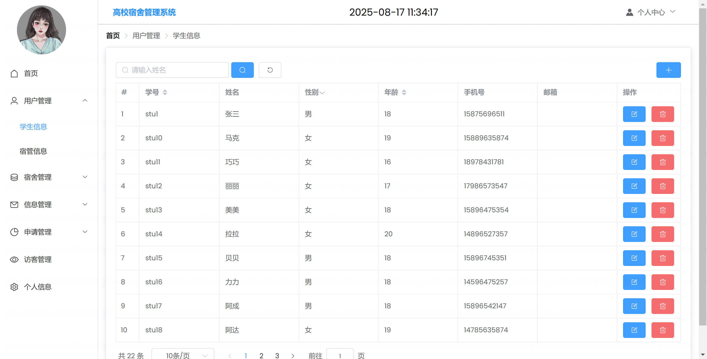

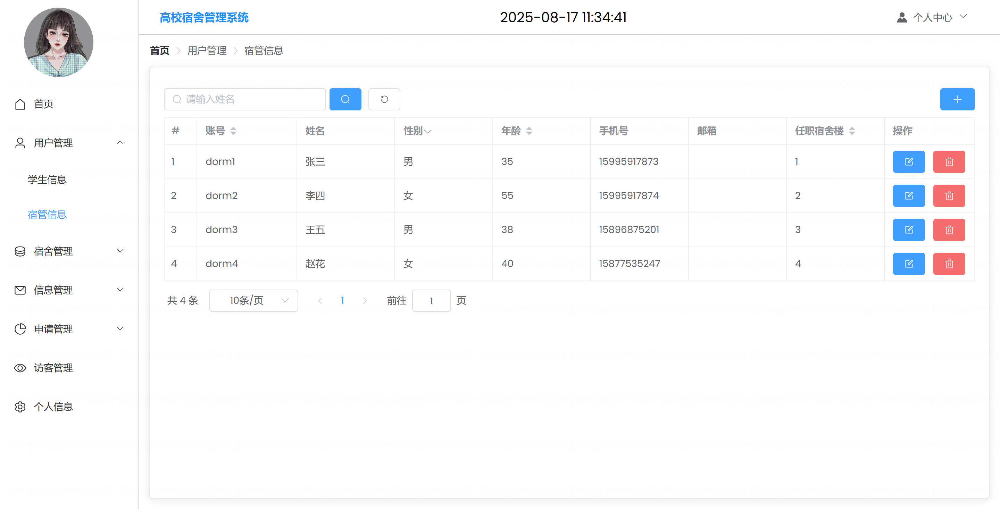

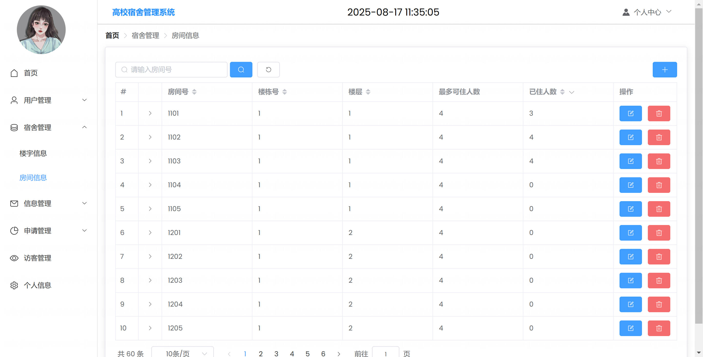

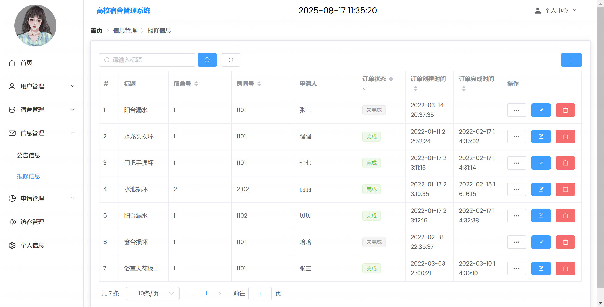

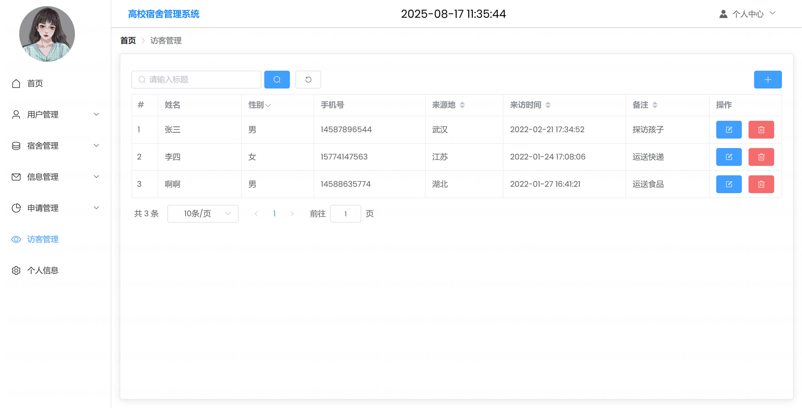

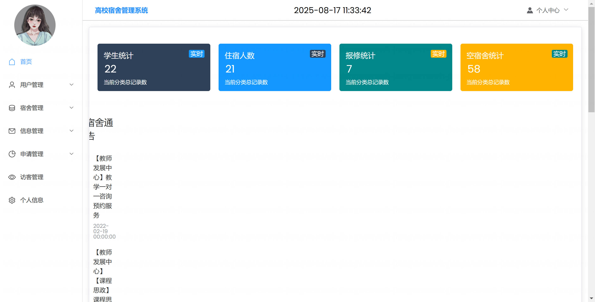

